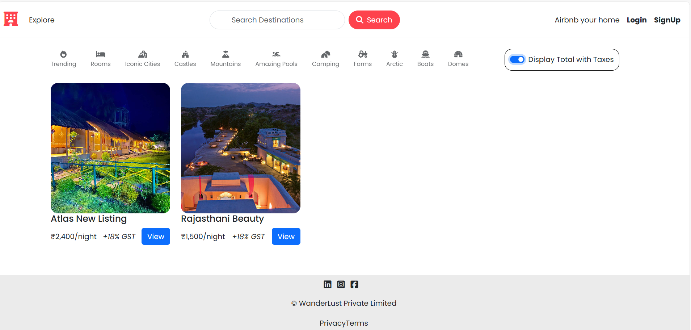
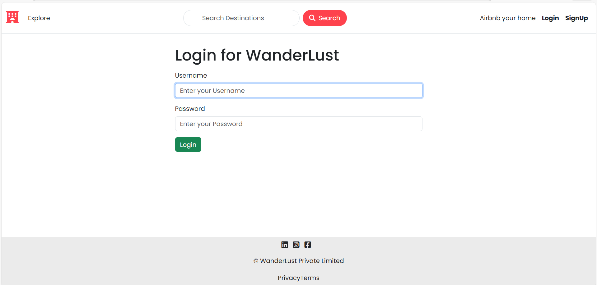
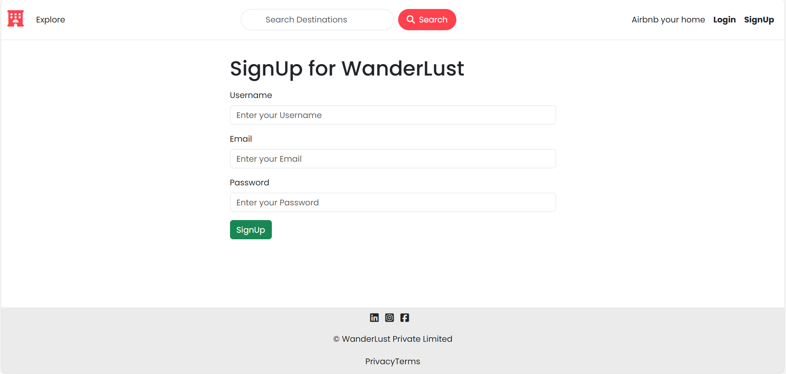
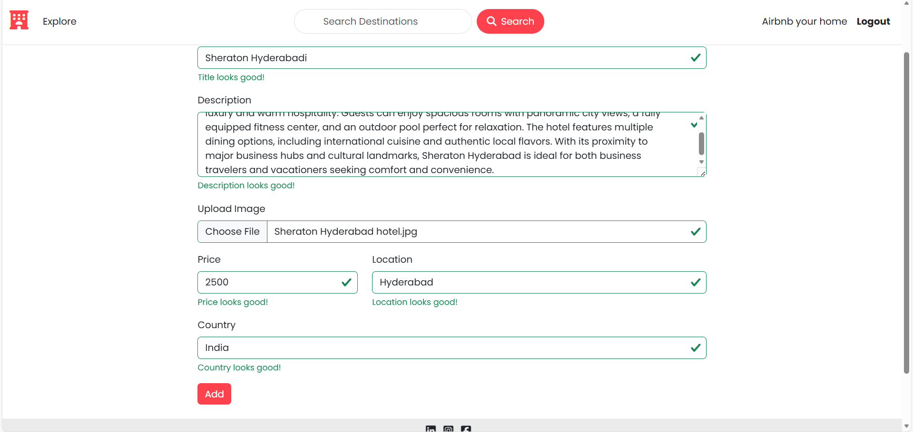
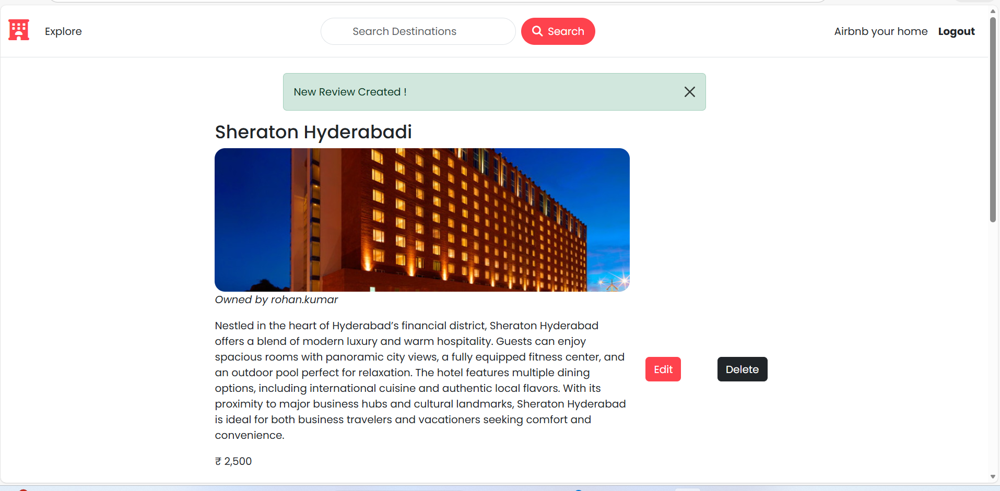
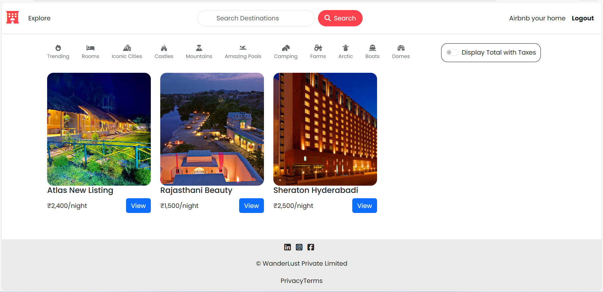

# Project Screenshots

Below are the screenshots of the project for quick reference.

---

### 🖼️ Screenshot 1

### 🖼️ Screenshot 2

### 🖼️ Screenshot 3

### 🖼️ Screenshot 4

### 🖼️ Screenshot 5

### 🖼️ Screenshot 6

### 🖼️ Screenshot 7

---

All images are stored inside the **Screenshots** folder in the project.
